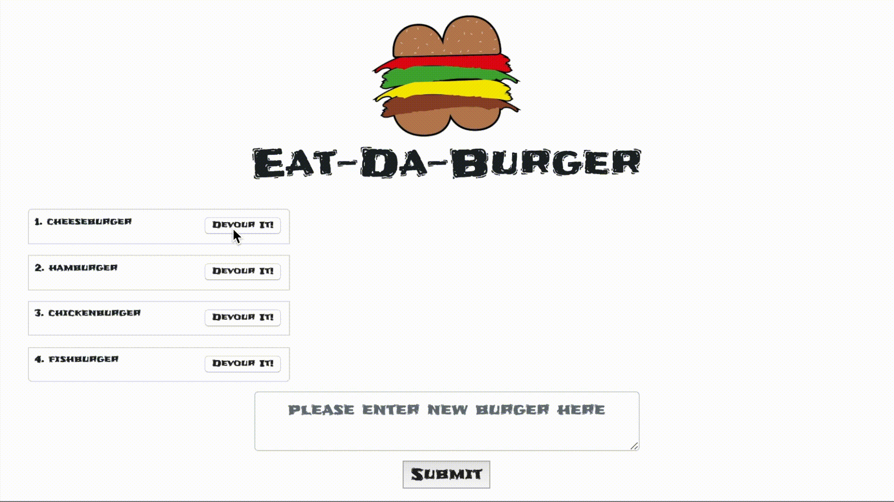
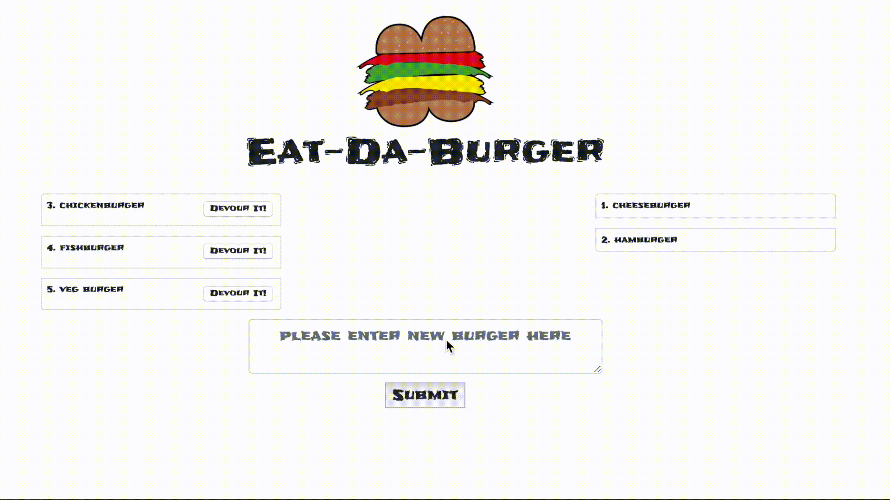

# Eat-Da-Burger
Burger logger with MySQL, Node, Express, Handlebars and a homemade ORM, follows MVC design pattern;

### Devour it!
Each burger has a "Devour it!" button that when clicked will update the mysql database to show it has been devoured.  The burger name will move to the right side of the screen.  Indicating to the user the burger has been eaten.

<!--  -->

### Create-a-Burger
The user inputs the name of the burger in the textbox they want to create that will be added to the mysql database and rendered on the left side of the screen.

<!--  -->

